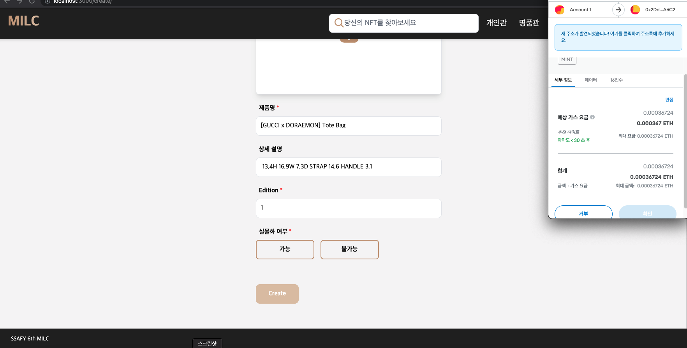
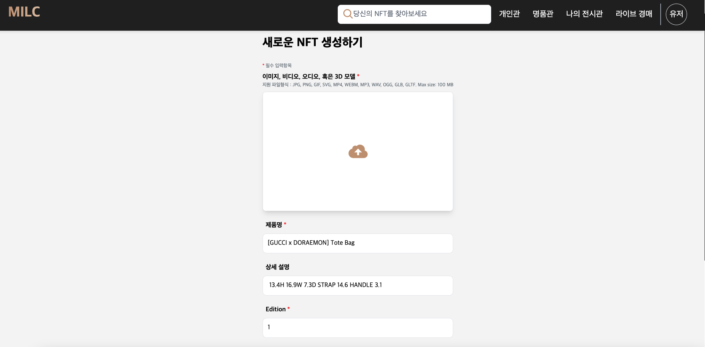

# 1. WISH 서비스 이름 & 소개

## 1.1. 서비스 이름

### **MILC**

```
- 명품 디지털 인증서 발급과 자유로운 NFT 거래 플랫폼
- 소유의 패러다임을 바꿔줄 나만의 전시장
```

## 1.2. Overview

### 1) 기획배경

- 패션 플랫폼 사업 정품 인증 논란(무신사 vs KREAM)
  - 명품 진품 논란에 대한 신뢰성 확보가 필요하다. 블록체인(NFT) 기술을 활용한 신뢰성 확보
- 명품의 소유자가 명확하지 않는 문제
- 명품 NFT 시장 규모가 2030년까지 560억 달러(66조 8000억원)에 이를 것으로 전망
  - 명품 브랜드들의 NFT 발행 증가 -> 자체 아이덴티티 NFT화의 부가가치가 크다고 여기기 때문.
- 실물자산이 없는 디지털 자산이라고 하더라도 그에 대한 가치를 이해하고 인정하는 사람들이 많아지고 있다.
  - 랄프로렌에서 디지털 의류를 판매했는데 몇 주만에 10만개를 판매했다. 이는 실물자산이 아닌 랄프로렌이라는 아이덴티티의 가치를 인정하는 행위.
- 뉴 럭셔리 소비 시대
  - 디지털화, MZ(모든 백화점에서 MZ세대 소비 증가), 명품 resell 열풍(투자)
- 가전 시장의 NFT 서비스 가능성 확대(삼성전자 TV => CES 혁신상 수상) -> 이를 활용해 나만의 전시장을 만들어 명품이나 예술품들을 전시

### 2) 고객층 & 서비스 내용

- 실질적인 가치에 중점을 두는 사람(실물자산이 아닌 해당 아이템 그 자체에 가치를 두는 사람)
  - 랄프로렌 디지털 의류와 같이 브랜드의 디지털 자산에 가치를 인정하는 사람들을 공략
  - NFT 디지털 인증서를 선발급 해줌으로써 즉시 해당 제품에 대한 소유를 인정받을 수 있고 실물자산 신청 여부는 추후에 고민이 가능합니다.
- 명품에 관심이 있으면서 NFT에 관심이 있는 사람 + 투자에 관심이 많은 사람
  - 현재 NFT 시장은 투자의 성향을 많이 띄고 있습니다. 그렇게 때문에 많은 사람들이 그냥 한 폭의 그림도 수천억원에 거래되는 경우가 있습니다. 명품 제품의 경우 많은 사람들이 구매를 한 이후 일정 시간동안 보관을 하고 있다가 시간이 흘러 가격이 많이 상승했을 때 다시 되파는(resell)이 굉장히 빈번하게 일어나고 있습니다. 이러한 투자 성향이 명품 시장에서도 많이 보이고 있기 때문에 충분히 이러한 고객들을 공략할 수 있을 것입니다.
- LVMH 등 다양한 명품 회사 + 명품 실물 소유에 부담을 느끼는 사람(보관이 어려운 경우)
  - 명품회사의 경우 NFT를 직접 발급하지만, 실물 자산은 바로 제작하지 않아도 되는 장점(선발행 후제작)
  - 앞서 말씀드린 명품 리셀러들에게는 실물자산을 보관하는 것 자체에 많은 비용과 시간이 들기 때문에 이러한 문제를 한 번에 해결할 수 있다는 점에서 경쟁력이 있다고 생각했습니다.
  - 신발 컬렉터들의 경우 본인이 신는 용도 + 전시용 + 보관용 이렇게 3켤레는 사는 사람들도 많고 명품의 경우 사서 전시만 해놓고 직접 착용을 하지 않는 사람들도 많은 부분을 공략
  - 해당 서비스에 대해 추가적으로 설명드리면 디지털 자산에 중점을 두고 실물자산 보관에 어려움을 느끼는 고객의 경우 해당 명품 제품에 대해 NFT 인증서를 구매함으로써, 즉시 해당 명품을 소유했다는 인증이 되고 추후에 실물 자산을 받고 싶다면 해당 업체에 실물 자산을 요청할 수 있게 됩니다. 다만, 실물 자산을 요청하는 경우 NFT에 실물자산을 요청했다는 내용이 들어가게 되고 해당 NFT는 거래 정지가 됩니다. (해당 내용에 대한 추가적인 문제점들에 대해서는 기술개발이 완료된 이후 관련 자료를 취합해서 대응 전략을 세울 계획입니다.)

### 3) 핵심 기능

- NFT 명품 디지털 인증서
  - 명확한 소유자와 거래 과정 그리고 최초 인증서 발급 회사를 확인할 수 있는 NFT 디지털 인증서
  - 최초로 명품 회사에서 해당 브랜드 제품에 대한 NFT를 우리 플랫폼에서 발급하고 판매 진행
- NFT 거래
  - Opensea와 같이 자유로운 NFT 거래
  - 최초의 NFT를 구매한 구매자들은 자유롭게 해당 NFT를 플랫폼에서 판매 가능
- NFT 실물화 과정
  - NFT를 실물화 하게 되면 NFT 거래 정지 및 해당 실물화 내용이 NFT에 기록될 수 있게 구현
- NFT 갤러리
  - NFT로 구매한 명품을 디스플레이에 전시할 수 있게끔 이미지 제공(360˚)
- 라이브 커머스(명품 NFT 경매 시스템)
- 코인 발행 + 지갑 생성 (코인은 우리만의 코인 JPMP 발행)
- 전반적인 사이트 컨셉은 [Opensea.io](http://Opensea.io) 참고

### 4) 기대효과

- 실물자산의 디지털화

- permission-less를 통한 NFT 활용도 증가

- 명품 비대면 거래 가능

- 명품 nft 선발급으로 실물 자산에 대한 보관 부담 감소

- 메타버스 플랫폼과의 융합 가능성

- 범죄(절도)예방

- 가치 보존 (감가상각 X)

## 1.3. 주요 서비스 화면

### 1.3.1. 메인페이지


### 1.3.2. 회원가입~로그인

### 1.3.3. 개인관


### 1.3.4. 명품관


### 1.3.5. 제품 상세 페이지

- 제품 민팅






- 제품 판매


제품 구매


### 1.3.6. 검색 필터링 페이지


### 1.3.7. 나의 전시관

추후 업로드 예정

### 1.3.8. 라이브 경매

추후 업로드 예정

### 1.3.9. 개인 프로필 수정


### 1.3.10. 기업 프로필 수정

- 배경 영상 업로드


### 1.3.11. 개인 프로필


### 1.3.12. 기업 프로필


# 2. 주요 기술 스택

## 2.1. 개발환경

| 분류     | 환경              | 버전                   | 주소                                   |
| -------- | ----------------- | ---------------------- | -------------------------------------- |
| Database | MySQL             | 8.0.x                  | https://dev.mysql.com/downloads/mysql/ |
|          | Redis             |                        | https://redis.io/                      |
| Back     | JAVA              | Open JDK 11            |                                        |
|          | Intellij          | Intellij IDE 2021-03-0 |                                        |
|          | JPA               |                        |                                        |
|          | Spring Security   |                        |                                        |
|          | lombok            |                        |                                        |
| Front    | React             | 17.0.2                 | https://ko.reactjs.org/                |
|          | Next.js           | 12.1.0                 | https://nextjs.org/                    |
|          | Tailwind CSS      |                        | https://tailwindcss.com/               |
|          | Cloudflare        |                        | https://www.cloudflare.com/ko-kr/      |
|          | Sock.js           | 1.6.0                  |                                        |
|          | Recoil            | 0.5.1                  | https://recoiljs.org/ko/               |
|          | web3.js           | 1.7.1                  |                                        |
|          | Three.js          | 0.138.3                |                                        |
|          | react-three-fiber | 7.0.26                 |                                        |
| Server   | pm2               | 5.2.0                  |                                        |
|          | docker            | 20.x                   |                                        |
|          | node              | 16.14.1                |                                        |
|          | nginx             | 1.18                   |                                        |


## 2.3. ERD


# 3. 각 팀원 역할

- 오세헌
  - 배포
    - BackEnd : jenkins를 통한 CI/CD
    - FrontEnd : PM2를 사용하여 서버에서 직접 배포
    - IPFS : 도커로 서버에서 직접 배포
  - 경매방 api
    - Rest API : 경매방 생성, 리스트, 종료, 상세 조회
    - Socket
  - UCC 제작
- 윤관
  - Web3.js 와 스마트 컨트랙트 연동
    - 구매
    - 판매
    - 실물화
    - 민팅
    - API 활용한 상호작용까지
  - UI
    - 로그인
    - 회원가입
    - 실물화 신청 리스트
    - 구매/판매 Modal
    - Create 민팅
  - API 연동
    - 실물화 신청
    - 실물화 신청 리스트
    - 구매
    - 판매
    - 소유권 이전
    - 스마트 컨트랙트 연동
    - 상품 상세 페이지
- 장원종
  - 프로젝트 세팅
    - Hook (useUser, useMutation)
    - 개발 환경 구축 (\_app, \_document, \_middleware 등)
    - 컴포넌트, Layout 설계
  - 상태 관리
    - Recoil을 통해 access token 로그인 유지
    - 계정 구분 (useRole)
  - Back API 연동
    - 로그인
    - 회원가입 (닉네임 중복 확인)
    - 프로필 수정 (정보, 사진, 영상 Cloudflare API)
    - 개인/기업 프로필 정보 조회 (해당 user 정보 조회, 해당 user nft 조회)
    - 좋아요
    - 실물화 요청 및 요청 리스트
  - UI
    - 프로필 수정
    - 개인/기업 프로필
    - 기업관
    - 명품관
    - 실물화 요청 modal
    - 개인 실물화 요청 리스트
    - item card
    - 상품 상세
- 장현진
  - 프로젝트 세팅
    - Entity , layer 설계
    - websocket
      - stomp
  - 로그인
    - JWT 와 spring security , redis 를 이용한 토큰로그인
  - Rest API
    - NFT
      - CRUD 기능 , 좋아요 표시
    - 실물화 보드
      - CRUD 기능
    - 회원관리
      - CRUD 기능 , jwt 토큰인증 , 재인증 (토큰 재발급)
  - CustomException
    - 에러 처리를 통합적으로 하기위한 예외처리 관리
- 최소희
  - Navbar
    - 로그인 여부에 따른 메뉴 변경
    - 반응형 적용
  - 전시관 기능
    - three.js를 활용한 나만의 전시관 기능 제공
  - 라이브 경매 기능
    - sock.js를 활용한 실시간 채팅 기능 구현
    - 실시간 경매 기능
      - 최고가 갱신 기능 추가
    - 타이머 기능
      - 라이브 진행시간 및 현재시간 차이 계산하여 남은 시간 렌더링
      - 진행시간이 마감되면 최고가 유저에 한하여 구매 버튼 활성화
  - 검색 필터링 페이지
    - 판매관, 가격범위, 최신순, 인기순, 가격순 필터링 기능 제공
  - 협업툴 관리
    - 노션을 활용한 팀미팅 및 프로젝트 작업 내용 정리
- 홍지범
  - 스마트 컨트랙트
    - NFT
      - ERC165 ⇒ ERC721 ⇒ ERC721URIStorage ⇒ NFT의 상속 구조로 openzeppelin을 이용한 nft표준을 준수해 구현
        - 토큰 민팅
        - 토큰 거래내역 추적
        - 실물화
    - NFT 마켓
      - ReentrancyGuard ⇒ Marketplace의 상속 구조로 재진입 방지 기능을 넣어 마켓에서 이루어지는 기능의 재진입을 방지
        - 토큰 마켓에 올리기
        - 아이템 구매(소유권 이전)할 때 마다 해당 NFT인스턴스를 이용해 해당 거래내역 기록 ⇒ 추후 거래 추적에 사용
  - Web3.js
    - 구매
    - 판매
    - 실물화
    - 민팅
  - IPFS

# 4. 기술 특이점

## 4.1. **계정별 기능**

- admin : 관리자
  - Header의 계정 관리 버튼 활성화 → 기업 회원 가입 (우리 서비스를 이용하는 기업에게 계정을 만들어서 제공)
- enterprise : 기업 (고객사)
  - Header의 NFT 생성 버튼 활성화 → 민팅
  - 명품관 입점 : 명품관은 백화점처럼 우리 서비스를 이용하는 모든 기업들을 보여주는 곳
  - 프로필 : 검은 배경, 골드 색상, 프로필 이미지, 배경 영상 등 고급스러운 프로필 디자인 제공
    - 판매 목록 : 기업이 판매로 전환하여 판매중인 NFT 리스트
    - 보유 목록 : 기업이 민팅 후 판매로 전환하지 않은 NFT 리스트 (기업에게만 tab 활성화)
    - 판매 현황 : 기업이 판매한 NFT 추적 (기능 구현 X)
  - 실물화 상태 변경 (확인 후 승인)
- consumer : 개인
  - 개인관 : 개인이 판매 중인 모든 NFT 리스트 보여줌
  - 프로필 : 프로필 이미지, 배경 이미지, 소개 등 자신만의 프로필 제공
    - 판매 목록 : 판매로 전환하여 판매중인 NFT 리스트
    - 보유 목록 : 개인이 구매 후 판매로 전환하지 않은 NFT 리스트 (보유중일 때 상품 상세 페이지에서 실물화 가능)
    - 관심 목록 : 개인이 좋아요를 클릭해 등록한 NFT 리스트
  - 실물화 요청 및 실물화 내역 확인 가능 (해당 상품 실물로 받고 싶을 때 요청 후 기업의 승인 기다림)

## 4.2. **전시관**

- three.js를 활용한 전시관 기능 제공
  - 보유한 NFT 제품을 연결하여 렌더링
  - useRef로 데이터 기억 후, useLoader로 3D모형 파일(gltf) 로드하여 모델 갱신
  - model.scene 파일을 불러와 텍스터 데이터 업데이트하여 갱신

## 4.3. **라이브 경매**

- cloudflare를 활용하여 어느 디바이스에서든 접속 가능한 스트리밍 기능을 제공
- sock.js 및 stomp를 활용한 실시간 경매 및 채팅 구현
  - 최고가가 갱신될 때마다 데이터 갱신
  - 유저의 nickname과 채팅 sendername이 동일 여부에 따라 메시지 방향 반전
- 타이머 기능 구현
  - 진행 시간이 끝나면 최고가 갱신한 유저한테 구매 버튼 활성화

## 4.4. 검색 필터링 페이지

- 판매관,가격범위,최신순,인기순,가격순 필터링 기능 제공

## 4.5. NFT

- ERC 165 : 인터페이스 확인 구현 후 스마트 컨트랙트에 주어진 인터페이스를 언제 사용하는지 감지
  - `function supportsInterface` : 컨트랙트의 각 함수 셀렉터(해시값)를 xor연산을 이용해 확인
- ERC721
  - `function balanceOf` : 오너가 가진 토큰 수 반환
  - `function ownerOf` : 해당 토큰의 오너 주소 반환
  - `function tokenURI` : 해당 토큰의 URI 반환
  - `function approve` : 해당 토큰에 요청을 보낸 계정을 전송 승인 처리
  - `function getApproved` : 해당 토큰의 전송 승인된 주소 반환
  - `function setApprovalForAll` : 자신이 보유한 모든 토큰에 대한 operator가 전송 권한을 갖게함
  - `function isApprovedForAll` : 해당 operator가 오너의 토큰 전송권한을 가진지 확인
  - `function transferFrom` : from에서 to 주소로 토큰 전송
  - `function safeTransferFrom` : from에서 to 주소로 토큰 전송. 만일 호출자가 from이 아니라면 approve 또는 setApproveForAll을 통해 토큰 전송을 허가받았어야 함
  - `function _safeTransfer` : from에서 to로 토큰 전송
  - `function _exists` : 오너에게 해당 토큰이 존재하는지 확인
  - `function _safeMint` : erc721Receiver을 이용해 구현된 컨트랙트에만 보낼 수 있도록 민팅
  - `function _mint` : 토큰을 민팅
  - `function _burn` : 토큰을 소각
  - `function _transfer` : 토큰을 전송
- ERC721URIStorage
  - `function tokenURI` : 해당 토큰의 uri를 반환
  - `function _setTokenURI` : 해당 토큰에 uri 설정
- ReentrancyGuard
  - `function nonReentrant` : 재진입 방지
- NFT
  - `function mint` : 토큰을 민팅
  - `function TokenTracking` : 해당 토큰의 거래 내역을 반환
  - `function addTokenReceipt` : 해당 토큰 거래 내역에 최신 거래 추가
  - `function isRealization` : 해당 토큰이 실물화(명품nft를 실물로 발급) 여부 반환
  - `function Realization` : 해당 토큰을 실물화 처리
- Marketplace
  - `function makeItem` : 해당 토큰을 판매 상태로 올림 ⇒ 아이템
  - `function purchaseItem` : 해당 아이템을 구매해서 토큰의 오너를 to로 바꿈
  - `function cancelItem` : 판매 상태로 올라와있는 아이템을 마켓에서 내리고 토큰을 원 주인에게 돌려줌
  - `function nftInMarket` : 해당 토큰이 마켓에 있는지 확인
  - `function lastValidTransaction` : 해당 아이템의 판매 가능한지 판별(마켓에 올라온 아이템의 id는 지워지지 않고 계속 쌓여있으므로 맨 뒤에서부터 앞으로 인덱스를 줄이며 해당 아이템이 판매 가능한지 판별)

# 5. 서비스 배포 주소 및 테스트 계정

- 배포주소 https://j6e206.p.ssafy.io/
- 테스트 계정
  [기업 test id] test@ent test [개인 test id] test@con test


# 6. 협업Tool 링크

### 1) 노션

https://www.notion.so/NFTeam-e6fad6d84586477c87e7b8c46c3d2558

### 2) 게더타운

https://app.gather.town/invite?token=bC7Xh_YMUj5g5XuaeKS9Nz0DGRKjfbPB

### 3) 와이어프레임

https://www.figma.com/file/nLlnGmyGkDzllxzNs9MAiU/우리의-진짜-와이어프레임-ㅎ-ㅎ?node-id=6%3A151

### 4) 기능명세서 & API 명세서

https://docs.google.com/spreadsheets/d/1LmA5hstz06HV0FCEk85Po14DZmxOPTpGBE7HRuYEUAE/edit#gid=0

### 5) ERD 설계

https://www.erdcloud.com/d/yndN6ywmEE8owd469

### 6) 컴포넌트 설계서

https://docs.google.com/presentation/d/1V-ZiJSlYAYCmjIk23S2nD8SwWKorm8yEcBr9UwfUSJM/edit#slide=id.p
