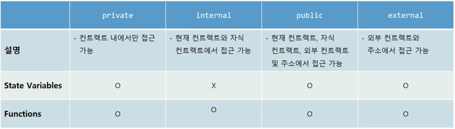

[TOC]

# 블록체인

- 분류

| 유형       | 특징                                                         | 관련 기술                                                    |
| ---------- | ------------------------------------------------------------ | ------------------------------------------------------------ |
| public     | 누구나 네트워크에 참여<br />- 메인넷<br />- 테스트넷 : Ropsten | Bitcoin, Ethereum, Zcash, Litecoin, ...                      |
| private    | 하나의 조직/기관이 관장하는 네트워크<br />승인된 주체만 자료를 읽고, 지정 노드만 거래를 승인 | Quorum, MultiChain, Iroha, Monax, ...                        |
| consortium | 이해 관계자 간에 컨소시엄을 구성하여 네트워크를 구성<br />네트워크 참여자에 의해 접근 허용 | Hyperledger Fabric, Tendermint, R3 Corda, Private Technologies, ... |


## Ethereum

- 단위 `1 ether = 10^9 Gwei = 10^18 wei`
- 0x 접두사 : 16진수. 프로그램, 계약, API에 입력이 16진수로 해석되어야 함을 알리는 방법


## Ropsten

- 환경 setting

  - MetaMask

  - Ropsten faucet : test eth 받기

  - metamask provider

    https://docs.metamask.io/guide/ethereum-provider.html

    ```
    # 연결 상태 확인
    ethereum.isConnected()
    
    # 계정 활성화
    ethereum.enable()
    
    # 활성화된 계정 확인
    ethereum.selectedAddress
    
    # Ethereum Provider로 RPC API 보내기
    ethereum.request({
        method: 'eth_blockNumber',
        params:[]
    }).then(result => console.log(result));
    
    parseInt('0xb70b96', 16)
    ```

    

# Smart Contract

- 정의 

  - 1990년대 Nick Szabo가 소개

    > 자연어로 된 계약 내용을 프로그래밍 언어로 바꾸기 위함

  - 디지털 형식으로 명시된 서약(commitment)들의 집합

  - 결코 스마트 하지 않은 단순 컴퓨터 프로그램

  - 법적 맥락 없음

  - 다소 잘못된 용어임에 불구하고 자리잡음

- 블록체인에서의 정의
  - 컴퓨터 프로그램
  - 불변 (한 번 배포되면 변경 불가)
  - 결정적 (실행한 결과가 모두 같음)
  - EVM 위에서 동작
  - 탈중앙화된 World Computer 동일한 상태를 유지

- 언어
  - Solidity
  - LLL
  - Viper
  - Assembly

## Solidity

- 컨트랙트(contract) 구조
  - 상태 변수(State Variable) : 블록체인에 값이 저장되는 변수. 다양한 자료형 존재(기본형, 구조체, 배열 등)
    - 상태 변수의 접근 제어자
    
      
    
  - 함수(function) : 컨트랙트 단위 기능. 매개 변수, 접근 제어자, 반환값 지정 가능
  
    - 함수명(매개 변수)
    - 접근 제어자
    - 속성
      - view : function 밖 변수들을 읽기O, 변경 X
      - pure : function 밖 변수들을 읽기X, 변경 X
    - 반환값 타입 `returns ()`

```solidity
// SPDX-License-Identifier: GPL-3.0	// 소스코드의 라이선스

pragma solidity >=0.7.0 <0.9.0;	// Version Pragma : 소스코드가 이용하는 컴파일러 버전   ※ 캐럿 연산자(^) : 이상


contract Storage {

    uint256 number;	// 상태 변수

    function store(uint256 num) public { // 함수
        number = num;
    }

    function retrieve() public view returns (uint256){ // 함수
        return number;
    }
}
```

- 자료형

  - 기본형 (Primitives)

    - 논리형

      - true
      - false

    - 정수형

      - uint (unsigned integer) = uint256

        > 음수가 아닌 integer

      - int (sigined integer)

    - 주소형

      - address : 이더리움의 주소

        > 지갑

    - 바이트형

      - bytes#
      - byte[]
    
  - 배열 (Array)
  
    - uint[]
  
  - 매핑 (Mapping)
  
  - Struct


# DApp (Decentralized Application)

- 정의
  - 탈중앙화된 P2P 네트워크 상에 백엔드 로직이 구동되는 응용프로그램
    - 블록체인 상의 스마트 컨트랙트가 기존의 중앙화된 서버에 의해 서비스를 제공하는 시스템 대체
  - 사용자 인터페이스를 통해 블록체인의 스마트 컨트랙트를 호출함으로써 동작하는 응용프로그램
  - Frontend + Smart Contracts on Blockchain
- 구성 요소
  - 스마트 컨트랙트
    - 서비스 로직이 구현된 이더리움 네트워크에 배포된 바이트코드
  - 사용자 인터페이스
    - 주로 HTML, CSS, JavaScript 등 프론트엔드 기술로 구현
  - Web3 API for JavaScript
    - 이더리움 스마트 컨트랙트와 JavaScript 코드 간의 상호작용 지원

## web3

- 정의

  - 이더리움 네트워크와 상호작용 할 수 있게 하는 JavaScript 라이브러리 모음

  